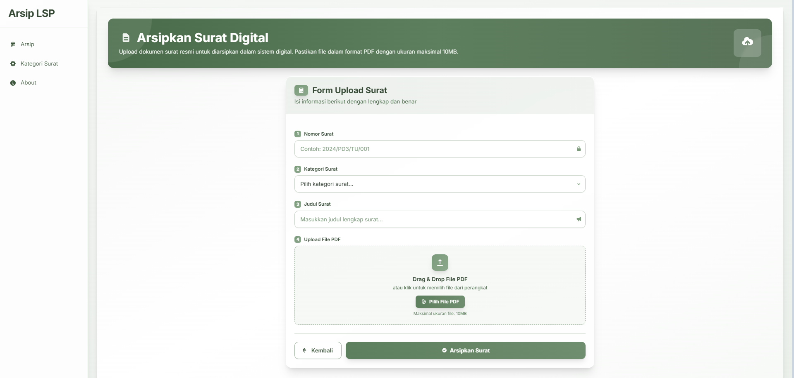

# Arsip LSP

Aplikasi web berbasis Laravel untuk mengelola arsip surat-surat dalam format PDF. Aplikasi ini menyediakan fitur pengkategorian surat, pencarian, serta manajemen arsip surat yang mudah dan efisien.

## Tujuan

Membantu pengguna dalam mengarsipkan, mengelola, dan mengakses surat-surat penting secara digital dengan fitur pencarian dan pengelompokan berdasarkan kategori.

## Fitur

- Manajemen Surat:
  - Upload surat dalam format PDF dengan validasi ukuran dan tipe file.
  - Menampilkan daftar surat dengan fitur pencarian berdasarkan judul.
  - Statistik arsip surat: total surat, surat bulan ini, minggu ini, dan hari ini.
  - Download surat dalam format PDF.
  - Hapus surat dari arsip beserta file terkait.
- Manajemen Kategori:
  - CRUD (Create, Read, Update, Delete) kategori surat.
- Halaman About yang menjelaskan aplikasi.

## Cara Menjalankan

1. Clone repository ini.
2. Jalankan `composer install` untuk menginstal dependensi PHP.
3. Salin file `.env.example` menjadi `.env` dan sesuaikan konfigurasi database.
4. Jalankan migrasi dan seeder database:
   ```
   php artisan migrate --seed
   ```
5. Jalankan server development Laravel:
   ```
   php artisan serve
   ```
6. Akses aplikasi melalui browser di alamat `http://localhost:8000`.

Pastikan Anda memiliki PHP versi 8.2 atau lebih baru dan ekstensi yang diperlukan oleh Laravel.

---
## Dokumentasi
Halaman Utama Arsip

Halaman Tambah Arsip

Halaman Edit Arsip

Halaman Hapus Arsip

Halaman Lihat Arsip

Halaman Utama Kategori Arsip

Halaman Tambah Kategori

Halaman Edit Kategori

Halaman Hapus Kategori

Halaman About


---
Dibangun dengan Laravel Framework versi 12.
